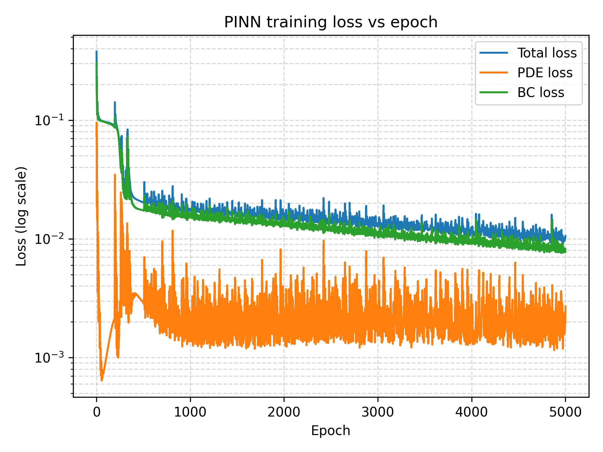
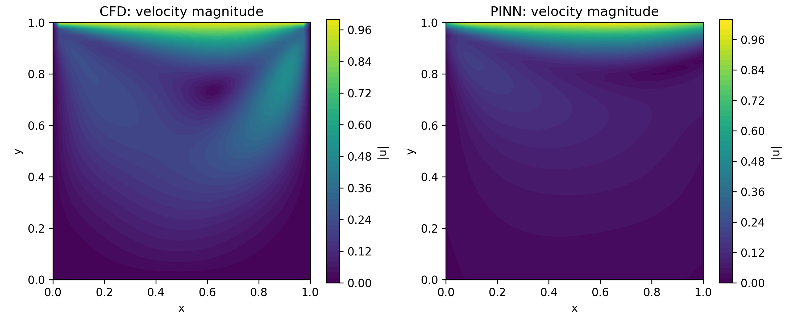

# Physics-Informed Neural Network (PINN) Solution of the 2D Lid-Driven Cavity Flow

This project implements a Physics-Informed Neural Network (PINN) to solve the 2D incompressible Navier–Stokes equations for the lid-driven cavity flow benchmark problem.
To validate the PINN’s accuracy, results are compared with a Finite Difference Method (FDM) CFD solver implemented separately.

Status: Educational/Academic demo – not intended as a production CFD solver.

Key Features:
-   PINN architecture for solving Navier–Stokes equations
-   Uses automatic differentiation to enforce PDE residuals
-   Boundary condition enforcement for lid-driven cavity
-   Classical CFD solver (FDM) for reference
-   Post-processing tools for side-by-side comparison
-   Error metrics for measuring PINN accuracy

Mathematical Formulation:
The PINN solves the steady 2D incompressible Navier–Stokes equations.
1. ∇⋅u=0
2. (u⋅∇)u=−∇p+ν∇2u
Boundary conditions for the unit cavity:
1. Lid (top wall): u=1,v=0
2. Other walls: u=0,v=0

Installation:

git clone https://github.com/Ved-Aiyar/pinn-lid-driven-cavity.git
cd pinn-lid-driven-cavity
python -m venv .venv
.venv\Scripts\activate
pip install -r requirements.txt

How to Run:
1.  Create virtual environment
2.  Install dependencies
3.  Train model
4.  Run post-process

CFD Solver:

A simple finite difference method is implemented to solve the same cavity flow problem at Re = 100.
The solver computes:
1.  u(x,y),v(x,y)
2.  p(x,y)
3.  Grid values
4.  Stored in .npz format under cfd/results/  

Results:
Relative L2 error (u): 3.33e-01
Relative L2 error (v): 9.06e-01

Figures:

Importance:
Demonstrates ML + CFD integration, PINN accuracy, and numerical methods.